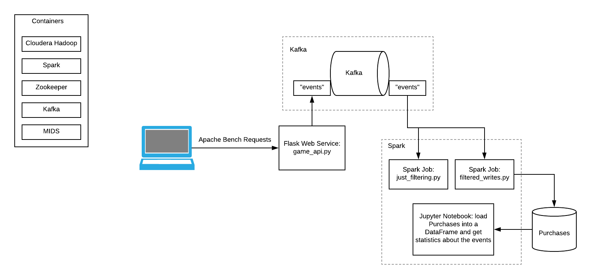

## Full Stack Workflow

In this project, a cluster of Zookeeper, Kafka, Cloudera (HDFS), Spark, and MIDS containers is started.  I create a Kafka topic to publish events to, which occurs from a Flask web service that is also launched.  Using the Apache Bench, I hit different URLs multiple times on the web service to generate events on the Kafka queue.  Using Spark, I submit a job to extract the events from the Kafka queue, convert them to JSON, filter them by event type, and display their output.  I update the web service with another method to write events for purchasing a knife to the Kafka queue.  Apache Bench hits the web service again to generate more events.  I submit another Spark job to filter out just the events for purchasing a sword, and write them to a Parquet file.  I launch the Jupyter notebook server and connect to the Spark server using Jupyter.  I then read the Parquet file and perform filtering on the event data by the host name.  

## Steps

1. mkdir ~/w205/full-stack/  
   cp docker-compose.yml ~/w205/full-stack  
   cp *.py ~/w205/full-stack  
   cd ~/w205/full-stack

**Explanation**  
Make a directory for the files and copy the files into this directory.  
The docker-compose.yml configures the Zookeeper, Kafka, Cloudera (HDFS), Spark, and MIDS containers.  

2. docker-compose up -d  

**Explanation**  
Start the containers in the cluster.  

**Output**  
matt@Sitka:~/w205/full-stack$ docker-compose up -d  
Creating network "fullstack_default" with the default driver  
Creating fullstack_mids_1  
Creating fullstack_cloudera_1  
Creating fullstack_zookeeper_1  
Creating fullstack_spark_1  
Creating fullstack_kafka_1  

3. docker-compose exec kafka kafka-topics --create --topic events --partitions 1 --replication-factor 1 --if-not-exists --zookeeper zookeeper:32181  

**Explanation**  
Creates an 'events' Kafka topic, with no replication.  

**Output**  
matt@Sitka:~/w205/full-stack$ docker-compose exec kafka kafka-topics --create --topic events --partitions 1 --replication-factor 1 --if-not-exists --zookeeper zookeeper:32181  
Created topic "events".  

4. docker-compose exec mids env FLASK_APP=/w205/full-stack/game_api.py flask run --host 0.0.0.0  

**Explanation**  
Starts the game_api.py web service hosted by Flask on port 5000. The handlers in this web service do two things: (1) write an event to Kafka with the name of the web method called, and (2) return a string representing the web method, which is output by Apache Bench.  

**Output**  
matt@Sitka:~/w205/full-stack$ docker-compose exec mids env FLASK_APP=/w205/full-stack/game_api.py flask run --host 0.0.0.0  
 * Serving Flask app "game_api"  
 * Running on http://0.0.0.0:5000/ (Press CTRL+C to quit)  
127.0.0.1 - - [11/Apr/2018 04:57:56] "GET / HTTP/1.0" 200 -  
127.0.0.1 - - [11/Apr/2018 04:57:56] "GET / HTTP/1.0" 200 -  
127.0.0.1 - - [11/Apr/2018 04:57:56] "GET / HTTP/1.0" 200 -  
127.0.0.1 - - [11/Apr/2018 04:57:56] "GET / HTTP/1.0" 200 -  
127.0.0.1 - - [11/Apr/2018 04:57:56] "GET / HTTP/1.0" 200 -  
127.0.0.1 - - [11/Apr/2018 04:57:56] "GET / HTTP/1.0" 200 -  
127.0.0.1 - - [11/Apr/2018 04:57:56] "GET / HTTP/1.0" 200 -  
127.0.0.1 - - [11/Apr/2018 04:57:56] "GET / HTTP/1.0" 200 -  
127.0.0.1 - - [11/Apr/2018 04:57:56] "GET / HTTP/1.0" 200 -  
127.0.0.1 - - [11/Apr/2018 04:57:56] "GET / HTTP/1.0" 200 -  
127.0.0.1 - - [11/Apr/2018 04:58:10] "GET /purchase_a_sword HTTP/1.0" 200 -  
127.0.0.1 - - [11/Apr/2018 04:58:10] "GET /purchase_a_sword HTTP/1.0" 200 -  
127.0.0.1 - - [11/Apr/2018 04:58:10] "GET /purchase_a_sword HTTP/1.0" 200 -  
127.0.0.1 - - [11/Apr/2018 04:58:10] "GET /purchase_a_sword HTTP/1.0" 200 -  
127.0.0.1 - - [11/Apr/2018 04:58:10] "GET /purchase_a_sword HTTP/1.0" 200 -  
127.0.0.1 - - [11/Apr/2018 04:58:10] "GET /purchase_a_sword HTTP/1.0" 200 -  
127.0.0.1 - - [11/Apr/2018 04:58:10] "GET /purchase_a_sword HTTP/1.0" 200 -  
127.0.0.1 - - [11/Apr/2018 04:58:10] "GET /purchase_a_sword HTTP/1.0" 200 -  
127.0.0.1 - - [11/Apr/2018 04:58:10] "GET /purchase_a_sword HTTP/1.0" 200 -  
127.0.0.1 - - [11/Apr/2018 04:58:10] "GET /purchase_a_sword HTTP/1.0" 200 -  
127.0.0.1 - - [11/Apr/2018 04:58:45] "GET / HTTP/1.0" 200 -  
127.0.0.1 - - [11/Apr/2018 04:58:45] "GET / HTTP/1.0" 200 -  
127.0.0.1 - - [11/Apr/2018 04:58:45] "GET / HTTP/1.0" 200 -  
127.0.0.1 - - [11/Apr/2018 04:58:45] "GET / HTTP/1.0" 200 -  
127.0.0.1 - - [11/Apr/2018 04:58:45] "GET / HTTP/1.0" 200 -  
127.0.0.1 - - [11/Apr/2018 04:58:45] "GET / HTTP/1.0" 200 -  
127.0.0.1 - - [11/Apr/2018 04:58:45] "GET / HTTP/1.0" 200 -  
127.0.0.1 - - [11/Apr/2018 04:58:45] "GET / HTTP/1.0" 200 -  
127.0.0.1 - - [11/Apr/2018 04:58:45] "GET / HTTP/1.0" 200 -  
127.0.0.1 - - [11/Apr/2018 04:58:45] "GET / HTTP/1.0" 200 -  
127.0.0.1 - - [11/Apr/2018 04:59:00] "GET /purchase_a_sword HTTP/1.0" 200 -  
127.0.0.1 - - [11/Apr/2018 04:59:00] "GET /purchase_a_sword HTTP/1.0" 200 -  
127.0.0.1 - - [11/Apr/2018 04:59:00] "GET /purchase_a_sword HTTP/1.0" 200 -  
127.0.0.1 - - [11/Apr/2018 04:59:00] "GET /purchase_a_sword HTTP/1.0" 200 -  
127.0.0.1 - - [11/Apr/2018 04:59:00] "GET /purchase_a_sword HTTP/1.0" 200 -  
127.0.0.1 - - [11/Apr/2018 04:59:00] "GET /purchase_a_sword HTTP/1.0" 200 -  
127.0.0.1 - - [11/Apr/2018 04:59:00] "GET /purchase_a_sword HTTP/1.0" 200 -  
127.0.0.1 - - [11/Apr/2018 04:59:00] "GET /purchase_a_sword HTTP/1.0" 200 -  
127.0.0.1 - - [11/Apr/2018 04:59:00] "GET /purchase_a_sword HTTP/1.0" 200 -  
127.0.0.1 - - [11/Apr/2018 04:59:00] "GET /purchase_a_sword HTTP/1.0" 200 -  

5. docker-compose exec mids kafkacat -C -b kafka:29092 -t events -o beginning  

**Explanation**  
The kafkacat function is called to return the all (-o beginning) of pending events on the 'events' topic (-t) on the Kafka queue.  Leaving off the -e runs it in continuous mode (does not exit).  

**Output** 
Outputs the event data in the Kafka queue (too long to show here).  

6. docker-compose exec mids ab -n 10 -H "Host: user1.comcast.com" http://localhost:5000/  
   docker-compose exec mids ab -n 10 -H "Host: user1.comcast.com" http://localhost:5000/purchase_a_sword  
   docker-compose exec mids ab -n 10 -H "Host: user2.att.com" http://localhost:5000/  
   docker-compose exec mids ab -n 10 -H "Host: user2.att.com" http://localhost:5000/purchase_a_sword  

**Explanation**  
Runs Apache Bench to request the given URL 10 times (-n 10) from the spoofed host (-H).  

**Output**  
Here is the output from the first Apache Bench command.  The others are similar:  

matt@Sitka:~/w205/full-stack$ docker-compose exec mids ab -n 10 -H "Host: user1.comcast.com" http://localhost:5000/  
This is ApacheBench, Version 2.3 <$Revision: 1706008 $>  
Copyright 1996 Adam Twiss, Zeus Technology Ltd, http://www.zeustech.net/  
Licensed to The Apache Software Foundation, http://www.apache.org/  

Benchmarking localhost (be patient).....done  

Server Software:        Werkzeug/0.14.1  
Server Hostname:        localhost  
Server Port:            5000  

Document Path:          /  
Document Length:        30 bytes  

Concurrency Level:      1  
Time taken for tests:   0.013 seconds  
Complete requests:      10  
Failed requests:        0  
Total transferred:      1850 bytes  
HTML transferred:       300 bytes  
Requests per second:    753.81 [#/sec] (mean)  
Time per request:       1.327 [ms] (mean)  
Time per request:       1.327 [ms] (mean, across all concurrent requests)  
Transfer rate:          136.19 [Kbytes/sec] received  

Connection Times (ms)  
              min  mean[+/-sd] median   max  
Connect:        0    0   0.0      0       0  
Processing:     1    1   0.6      1       2  
Waiting:        0    1   0.4      1       2  
Total:          1    1   0.6      1       2  

Percentage of the requests served within a certain time (ms)  
  50%      1  
  66%      1  
  75%      2  
  80%      2  
  90%      2  
  95%      2  
  98%      2  
  99%      2  
 100%      2 (longest request)  

7. docker-compose exec spark \
spark-submit /w205/full-stack/just_filtering.py  

**Explanation**  
Runs a Spark job which does the following:  
1. Extracts Kafka events from the 'events' topic
2. Casts the events as a string along with their timestamp, storing the output into a data frame
3. Filters those events on the 'raw' column, keeping the events whose 'event_type' is 'purchase_sword'
4. The filtered events are transformed into a data frame, and the schema of the data and the events themselves are printed out

**Output**  
Spark messages have been left out.  Showing the event schema and events:  

root  
 |-- Accept: string (nullable = true)  
 |-- Host: string (nullable = true)  
 |-- User-Agent: string (nullable = true)  
 |-- event_type: string (nullable = true)  
 |-- timestamp: string (nullable = true)  

 +------+-----------------+---------------+--------------+--------------------+  
 |Accept|             Host|     User-Agent|    event_type|           timestamp|  
 +------+-----------------+---------------+--------------+--------------------+  
 |   */*|user1.comcast.com|ApacheBench/2.3|purchase_sword|2018-04-11 04:58:...|  
 |   */*|user1.comcast.com|ApacheBench/2.3|purchase_sword|2018-04-11 04:58:...|  
 |   */*|user1.comcast.com|ApacheBench/2.3|purchase_sword|2018-04-11 04:58:...|  
 |   */*|user1.comcast.com|ApacheBench/2.3|purchase_sword|2018-04-11 04:58:...|  
 |   */*|user1.comcast.com|ApacheBench/2.3|purchase_sword|2018-04-11 04:58:...|  
 |   */*|user1.comcast.com|ApacheBench/2.3|purchase_sword|2018-04-11 04:58:...|  
 |   */*|user1.comcast.com|ApacheBench/2.3|purchase_sword|2018-04-11 04:58:...|  
 |   */*|user1.comcast.com|ApacheBench/2.3|purchase_sword|2018-04-11 04:58:...|  
 |   */*|user1.comcast.com|ApacheBench/2.3|purchase_sword|2018-04-11 04:58:...|  
 |   */*|user1.comcast.com|ApacheBench/2.3|purchase_sword|2018-04-11 04:58:...|  
 |   */*|    user2.att.com|ApacheBench/2.3|purchase_sword|2018-04-11 04:59:...|  
 |   */*|    user2.att.com|ApacheBench/2.3|purchase_sword|2018-04-11 04:59:...|  
 |   */*|    user2.att.com|ApacheBench/2.3|purchase_sword|2018-04-11 04:59:...|  
 |   */*|    user2.att.com|ApacheBench/2.3|purchase_sword|2018-04-11 04:59:...|  
 |   */*|    user2.att.com|ApacheBench/2.3|purchase_sword|2018-04-11 04:59:...|  
 |   */*|    user2.att.com|ApacheBench/2.3|purchase_sword|2018-04-11 04:59:...|  
 |   */*|    user2.att.com|ApacheBench/2.3|purchase_sword|2018-04-11 04:59:...|  
 |   */*|    user2.att.com|ApacheBench/2.3|purchase_sword|2018-04-11 04:59:...|  
 |   */*|    user2.att.com|ApacheBench/2.3|purchase_sword|2018-04-11 04:59:...|  
 |   */*|    user2.att.com|ApacheBench/2.3|purchase_sword|2018-04-11 04:59:...|  
 +------+-----------------+---------------+--------------+--------------------+  

8. Stop flask (press Ctrl-C)  

**Explanation**  
Stop the web service so it can be updated.  

9. Modify game_api.py to include:  

@app.route("/purchase_a_knife")  
def purchase_a_knife():  
    purchase_knife_event = {'event_type': 'purchase_knife', 'description': 'very sharp knife'}  
    log_to_kafka('events', purchase_knife_event)  
    return "Knife Purchased!\n"  

**Explanation**  
This writes an event to the Kafka queue that has an additional 'description' field.  This causes the schema to differ from the existing schema.  

10. docker-compose exec mids \  
env FLASK_APP=/w205/full-stack/game_api.py \  
flask run --host 0.0.0.0  

**Explanation**  
Starts the game_api.py web service hosted by Flask on port 5000.  This web service has an additional handler for /purchase_a_knife.  The handlers in this web service do two things: (1) write an event to Kafka with the name of the web method called, and (2) return a string representing the web method, which is output by Apache Bench.  

**Output**  
matt@Sitka:~/w205/full-stack$ docker-compose exec mids env FLASK_APP=/w205/full-stack/game_api.py flask run --host 0.0.0.0  
 * Serving Flask app "game_api"  
 * Running on http://0.0.0.0:5000/ (Press CTRL+C to quit)  
127.0.0.1 - - [11/Apr/2018 05:22:32] "GET /purchase_a_knife HTTP/1.0" 200 -  
127.0.0.1 - - [11/Apr/2018 05:22:32] "GET /purchase_a_knife HTTP/1.0" 200 -  
127.0.0.1 - - [11/Apr/2018 05:22:32] "GET /purchase_a_knife HTTP/1.0" 200 -  
127.0.0.1 - - [11/Apr/2018 05:22:32] "GET /purchase_a_knife HTTP/1.0" 200 -  
127.0.0.1 - - [11/Apr/2018 05:22:32] "GET /purchase_a_knife HTTP/1.0" 200 -  
127.0.0.1 - - [11/Apr/2018 05:22:32] "GET /purchase_a_knife HTTP/1.0" 200 -  
127.0.0.1 - - [11/Apr/2018 05:22:32] "GET /purchase_a_knife HTTP/1.0" 200 -  
127.0.0.1 - - [11/Apr/2018 05:22:32] "GET /purchase_a_knife HTTP/1.0" 200 -  
127.0.0.1 - - [11/Apr/2018 05:22:32] "GET /purchase_a_knife HTTP/1.0" 200 -  
127.0.0.1 - - [11/Apr/2018 05:22:32] "GET /purchase_a_knife HTTP/1.0" 200 -  

11. docker-compose exec mids ab -n 10 -H "Host: user1.comcast.com" http://localhost:5000/purchase_a_knife  

**Explanation**  
Make a HTTP GET request to the new web service using Apache Bench for purchase_a_knife.  This will write an event to the Kafka queue with the new schema.  

**Output**  
matt@Sitka:~/w205/full-stack$ docker-compose exec mids ab -n 10 -H "Host: user1.comcast.com" http://localhost:5000/purchase_a_knife  
This is ApacheBench, Version 2.3 <$Revision: 1706008 $>  
Copyright 1996 Adam Twiss, Zeus Technology Ltd, http://www.zeustech.net/  
Licensed to The Apache Software Foundation, http://www.apache.org/  

Benchmarking localhost (be patient).....done  

Server Software:        Werkzeug/0.14.1  
Server Hostname:        localhost  
Server Port:            5000  

Document Path:          /purchase_a_knife  
Document Length:        17 bytes  

Concurrency Level:      1  
Time taken for tests:   0.017 seconds  
Complete requests:      10  
Failed requests:        0  
Total transferred:      1720 bytes  
HTML transferred:       170 bytes  
Requests per second:    605.55 [#/sec] (mean)  
Time per request:       1.651 [ms] (mean)  
Time per request:       1.651 [ms] (mean, across all concurrent requests)  
Transfer rate:          101.71 [Kbytes/sec] received  

Connection Times (ms)  
              min  mean[+/-sd] median   max  
Connect:        0    0   0.3      0       1  
Processing:     1    1   0.4      2       2  
Waiting:        0    1   0.6      1       2  
Total:          1    2   0.5      2       3  
ERROR: The median and mean for the processing time are more than twice the standard  
       deviation apart. These results are NOT reliable.  

Percentage of the requests served within a certain time (ms)  
  50%      2  
  66%      2  
  75%      2  
  80%      2  
  90%      3  
  95%      3  
  98%      3  
  99%      3  
 100%      3 (longest request)  

12. docker-compose exec spark \  
spark-submit /w205/full-stack/filtered_writes.py  

**Explanation**  
Submit a Spark job called filtered_writes.py.  This job extends game_api.py by writing the filtered events to HDFS in Parquet format.  It uses the 'overwrite' option to overwrite the existing folder and file so a check is not needed to see if it already exists (which would throw an error).  

**Output**  
root  
 |-- Accept: string (nullable = true)  
 |-- Host: string (nullable = true)  
 |-- User-Agent: string (nullable = true)  
 |-- event_type: string (nullable = true)  
 |-- timestamp: string (nullable = true)  

 +------+-----------------+---------------+--------------+--------------------+  
 |Accept|             Host|     User-Agent|    event_type|           timestamp|  
 +------+-----------------+---------------+--------------+--------------------+  
 |   */*|user1.comcast.com|ApacheBench/2.3|purchase_sword|2018-04-11 04:58:...|  
 |   */*|user1.comcast.com|ApacheBench/2.3|purchase_sword|2018-04-11 04:58:...|  
 |   */*|user1.comcast.com|ApacheBench/2.3|purchase_sword|2018-04-11 04:58:...|  
 |   */*|user1.comcast.com|ApacheBench/2.3|purchase_sword|2018-04-11 04:58:...|  
 |   */*|user1.comcast.com|ApacheBench/2.3|purchase_sword|2018-04-11 04:58:...|  
 |   */*|user1.comcast.com|ApacheBench/2.3|purchase_sword|2018-04-11 04:58:...|  
 |   */*|user1.comcast.com|ApacheBench/2.3|purchase_sword|2018-04-11 04:58:...|  
 |   */*|user1.comcast.com|ApacheBench/2.3|purchase_sword|2018-04-11 04:58:...|  
 |   */*|user1.comcast.com|ApacheBench/2.3|purchase_sword|2018-04-11 04:58:...|  
 |   */*|user1.comcast.com|ApacheBench/2.3|purchase_sword|2018-04-11 04:58:...|  
 |   */*|    user2.att.com|ApacheBench/2.3|purchase_sword|2018-04-11 04:59:...|  
 |   */*|    user2.att.com|ApacheBench/2.3|purchase_sword|2018-04-11 04:59:...|  
 |   */*|    user2.att.com|ApacheBench/2.3|purchase_sword|2018-04-11 04:59:...|  
 |   */*|    user2.att.com|ApacheBench/2.3|purchase_sword|2018-04-11 04:59:...|  
 |   */*|    user2.att.com|ApacheBench/2.3|purchase_sword|2018-04-11 04:59:...|  
 |   */*|    user2.att.com|ApacheBench/2.3|purchase_sword|2018-04-11 04:59:...|  
 |   */*|    user2.att.com|ApacheBench/2.3|purchase_sword|2018-04-11 04:59:...|  
 |   */*|    user2.att.com|ApacheBench/2.3|purchase_sword|2018-04-11 04:59:...|  
 |   */*|    user2.att.com|ApacheBench/2.3|purchase_sword|2018-04-11 04:59:...|  
 |   */*|    user2.att.com|ApacheBench/2.3|purchase_sword|2018-04-11 04:59:...|  
 +------+-----------------+---------------+--------------+--------------------+  

13. docker-compose exec cloudera hadoop fs -ls /tmp/  
    docker-compose exec cloudera hadoop fs -ls /tmp/purchases/  

**Explanation**  
The first command lists the contents under /tmp folder in HDFS in order to check if /tmp/purchases/ exists.  
The second command lists the files under /tmp/purchases/, which is the Parquet file created by the Spark job.  

**Output**  
matt@Sitka:~/w205/full-stack$ docker-compose exec cloudera hadoop fs -ls /tmp/  
Found 3 items  
drwxrwxrwt   - mapred mapred              0 2018-02-06 18:27 /tmp/hadoop-yarn  
drwx-wx-wx   - root   supergroup          0 2018-04-11 04:55 /tmp/hive  
drwxr-xr-x   - root   supergroup          0 2018-04-11 05:23 /tmp/purchases  
matt@Sitka:~/w205/full-stack$ docker-compose exec cloudera hadoop fs -ls /tmp/purchases/  
Found 2 items  
-rw-r--r--   1 root supergroup          0 2018-04-11 05:23 /tmp/purchases/_SUCCESS  
-rw-r--r--   1 root supergroup       1634 2018-04-11 05:23 /tmp/purchases/part-00000-e7d200e5-6821-469c-9838-7c7480fb56fb-c000.snappy.parquet  

14. docker-compose exec spark env PYSPARK_DRIVER_PYTHON=jupyter PYSPARK_DRIVER_PYTHON_OPTS='notebook --no-browser --port 8888 --ip 0.0.0.0 --allow-root' pyspark  

**Explanation**  
Starts the Jupyter notebook server in the Spark container, so that PySpark can be written to execute Spark commands in a Jupyter notebook.  

**Output**  
Showed output from the Jupyter notebook server (too long to show). It displays a URL that is used to connect to it with a browser.  

15. In the Jupyter notebook, run the following commands:  
    purchases = spark.read.parquet('/tmp/purchases')  
    purchases.show()  
    purchases.registerTempTable('purchases')  
    purchases_by_example2 = spark.sql("select * from purchases where Host = 'user1.comcast.com'")  
    purchases_by_example2.show()  
    df = purchases_by_example2.toPandas()  
    df.describe()  

**Explanation**  
Runs commands in Spark that does the following:  
1. Reads the events written to the Parquet files  
2. Displays the events  
3. Creates a Spark SQL template called 'purchases' from the event data  
4. Selects the events from the 'purchases' table where the 'Host' is 'user1.comcast.com'  
5. Displays the filtered events  
6. Creates a Pandas DataFrame from the events  
7. Calls DataFrame.describe() to get statistical information about the events  

**Output**  
The output of the queries are displayed in the Jupyter notebook.  One query shows all events that are not filtered.  The second query shows the filtered events on 'user1.comcast.com'.  

16. docker-compose down  

**Explanation**  
Shuts down the cluster of containers.  

**Output**  
matt@Sitka:~/w205/full-stack$ docker-compose down  
Stopping fullstack_kafka_1 ... done  
Stopping fullstack_spark_1 ... done  
Stopping fullstack_zookeeper_1 ... done  
Stopping fullstack_cloudera_1 ... done  
Stopping fullstack_mids_1 ... done  
Removing fullstack_kafka_1 ... done  
Removing fullstack_spark_1 ... done  
Removing fullstack_zookeeper_1 ... done  
Removing fullstack_cloudera_1 ... done  
Removing fullstack_mids_1 ... done  
Removing network fullstack_default  

