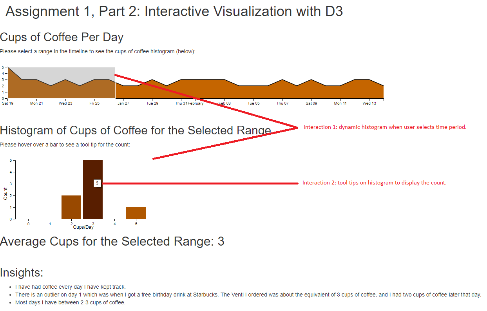

## Interactive Visualization using D3

For this project, I collected data from my personal consumption of coffee over a few weeks.  I then created a D3 visualization where the user can drag a 'brush' over the timeline.  A histogram for the coffee consumption and average number of cups of coffee over that time period are calculated and displayed.

Here is the link to the visualization: http://people.ischool.berkeley.edu/~mprout/D3Visualization

