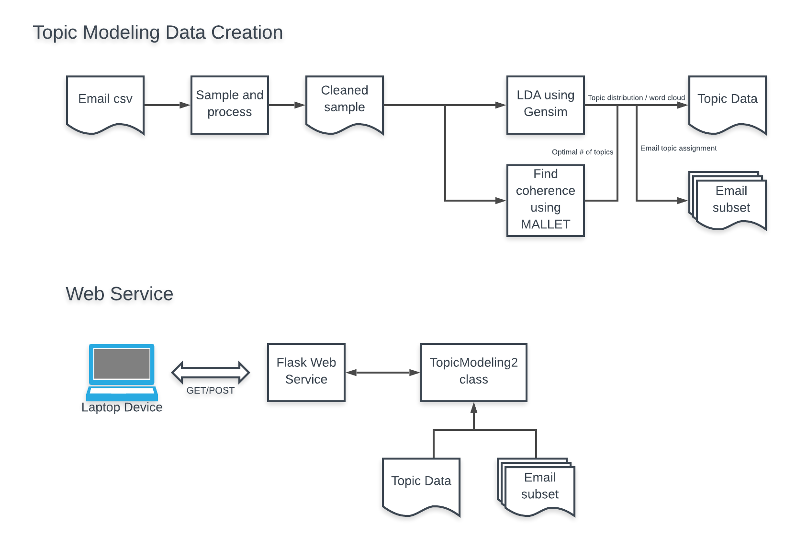
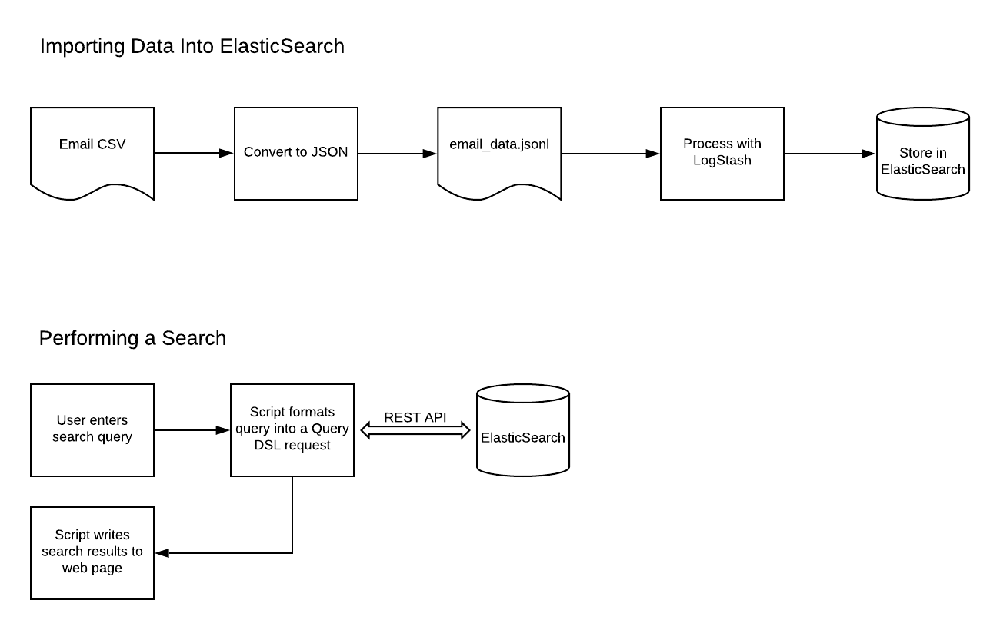

## Capstone Team Project: Docsund

### Team Members: Ryan Delgado, Andrew Carlson, Danielle O’Neil, Matthew Prout
&nbsp;
For the capstone class I joined a project called Docsund. The purpose of Docsund is to make it easier for journalists and researchers to search through document dumps to find stories. Our specific use case was email dumps.

Our team met with a stakeholder from Bloomberg to help us define the features. During the semester, we gave two project presentations to update the class on our status, and a [final presentation](./Docsund-FinalPresentation.pdf) to demonstrate our working product. After implementing our initial design, we met with the stakeholder to get feedback on the design which we incorporated into the final product.

The solution we came up with was an interactive, web based tool to allow the rapid exploration of large, unstructured document collections. It provides a full [search feature](https://www.youtube.com/embed/TxZVmN-LC2M) to quickly search for words within all the documents, and an intuitive browser for viewing results. An [entity browser](https://www.youtube.com/embed/OYIVy6CQeys) shows the relationship between entities (people, organizations, money, and time) in the document using a graph database. Finally, the [topic explorer](https://www.youtube.com/embed/Id9xXILpht0) automatically finds latent topics within the documents, giving the user a high level overview of the documents, and also starting points for further exploration.

My contribution to the project was processing the data provided by the user with the LDA algorithm and creating a web service with Flask that returns the processed data from a REST call. See the diagram below:

The front end, written by another teammate using JavaScript and D3, queries data from the web service and presents the data to the user in an interactive format. The user can select topics which display a word cloud for that topic, and a button displays emails associated with that topic as well. I also helped contribute to the landing page of our website, as well as doing proof of concept work for supporting ElasticSearch for our free text search:

