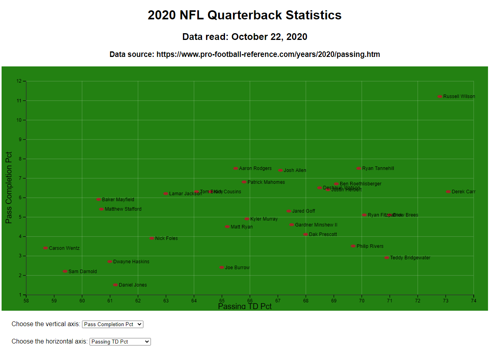
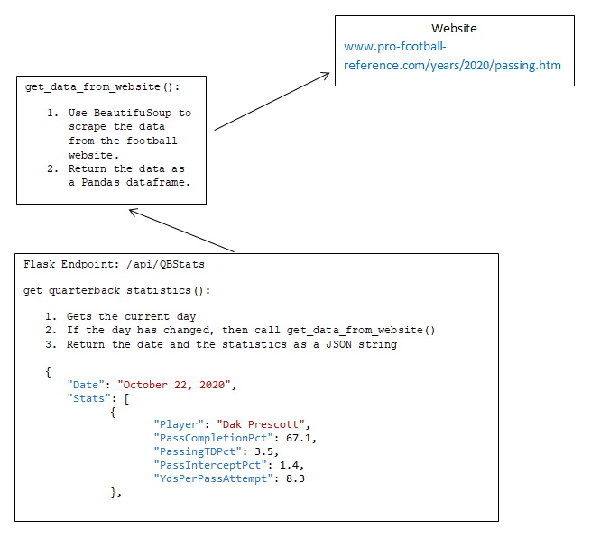
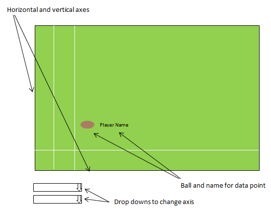
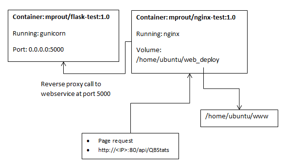
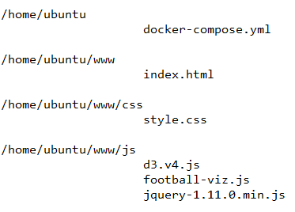

# Football Statistics Visualization  

This is the project I worked on in the fall of 2020.  This project showcases the following:
1. Creating a Flask web service which uses BeautifulSoup to screen scrape a website and return the data as JSON.
2. Create an interactive web page using D3.js that allows the user to select different statistics on each axis, and shows a visualization of that data with the player's names drawn next to a data point (football) on a scatter plot (field).
3. Create Docker containers for both the Flask web service that runs the Gunicorn HTTP server, and the front end web server which runs Nginx.
4. Deployment to AWS.  The Docker containers are deployed to the AWS EC2 instance and run using Docker Compose.

  

## Flask Web Service

The web service is built using Python and Flask.  It uses the BeautifulSoup library to screen scrape a website with NFL statistics for quarterbacks.  This information is stored into a Pandas data frame, which is converted to JSON.  The service only scrapes new data when the date from the last query is different from the current date, in order to improve performance.  

## Front End

The front end is an HTML page where the visualization is built using D3, and two controls at the bottom that allow the user to select the statistic to use for an axis.

The visualization is built up by composing multiple arrow functions to create different aspects of the visualization, such as the grid, axes, data points (footballs), and the names of players.  When the page is loaded and whenever the user changes an axis, drawVisual() is called.  This uses fetch() to query the web service for the data to display.  After the data is returned, it is filtered using a JavaScript function to choose the appropriate field for the given axis, and then passed to the D3 functions to build the SVG.  

## Deployment

  

### Flask Container

The Flask container is built from a python base container.  It runs Flask using Gunicorn on port 5000.

Docker command to build:
`docker build -t mprout/flask-test:1.0 .`  

### Front End Container

The front end container is built from a nginx base container.  It uses a VOLUME to mount a path to the web deployment copied to the server.  This allows the website files to be configured as necessary while still being used by the container.

The nginx.conf file is updated with custom configuration file.  This is done to support a reverse proxy, and will redirect requests that are not found on website to the Flask container on port 5000.

Docker command to build:
`docker build -t mprout/nginx-test:1.0 .`  

### Uploading to DockerHub

The Docker images were built and pushed to my repository on DockerHub.  From there, I can pull these images to the AWS EC2 instance used for deployment.  

### Running on AWS using Docker Compose

The following file structure is needed for the deployment:

  

Once the files structure has been established, run Docker Compose:
`docker-compose up -d`
