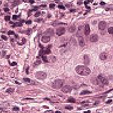

# Histopathologic Cancer Detection Using a CNN

The purpose of this notebook is to create an algorithm to identify metastatic cancer in small image patches taken from larger digital pathology scans. The data comes from Bas Veeling and was posted to the [Kaggle](https://www.kaggle.com/c/histopathologic-cancer-detection)  website.

This notebook gave me a chance to practice some of the concepts I learned in the [Deep Learning Specialization](https://www.coursera.org/specializations/deep-learning) course, especially the second course called "Improving Deep Neural Networks: Hyperparameter tuning, Regularization and Optimization." In addition, it also gave me a chance to try training a model on a Deep Learning AMI on AWS and learn how to setup this environment.
