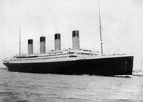

# Titanic: Machine Learning from Disaster

The purpose of this notebook is to develop a model which can predict whether a passenger would survive the sinking of the Titanic.  The data comes from the Titanic project on [Kaggle](https://www.kaggle.com/c/titanic).

First exploratory data analysis will be performed to understand the data. This will help determine features that may be useful for model building.

Next, the data is cleaned and features are built as necessary.

Finally, predictive models are built.
