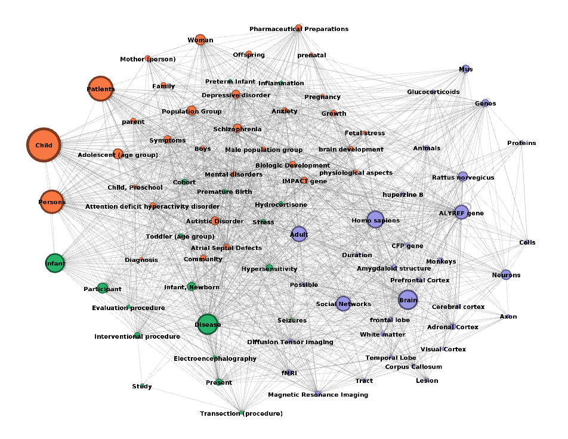

# ConceptualEyes

## Neuro Blink

The ConceptualEyes project is a set of technologies that allows users to gain insights into large corpuses of research papers. Papers are ingested with a pipeline into a graph database, using the SemRep software for named entity recognition.  Users are then able to query the data and see visualizations of how various concepts are related.

The purpose of the Neuro Blink project is to be able to apply the Blink tool for a corpus of documents related to neurological development, with the goal of understanding factors that cause learning disabilities later on in life.  This project is a partnership with the Bill and Melinda Gates Foundation, who has provided he funding, and investigators who have helped us with curating the papers for the corpus.

As the ConceptualEyes startup is small, I have performed a variety of duties: dev ops, pipeline development, full stack development, and data analyst.  One of the more interesting projects I helped out with was visualizing the data in the corpus.

**Preparing the Data**
The data was downloaded from a Postgres database running on CloudSQL as SUBJECT-PREDICATE-OBJECT triples using a Python program.  This data was then converted to .GRAPHML using NetworkX. At this point, I was able to load the data into Gephi.

**Exploration in Gephi**
In Gephi, I first filtered the nodes based on the degree.  This left only the nodes that had many relationships.  Next I sized the nodes based on degree, which made the nodes with the most connections large, and those with fewer nodes small.  After that, I performed community detection using the Louvain algorithm that is built into Gephi.  This categorized the nodes based on the partition that was found for the communities.  I then applied colors for each partition to highlight the different communities.  Finally, I used various force layouts to spread the nodes out, and also manually moved nodes so the labels would not obscure other labels.

One thing you can see from this visualization is that three communities were found;
* Concepts related to the brain (purple)
* Concepts related to groups of people, such as children, patients, and persons (orange)
* Concepts related to diseases and procedures (green)
